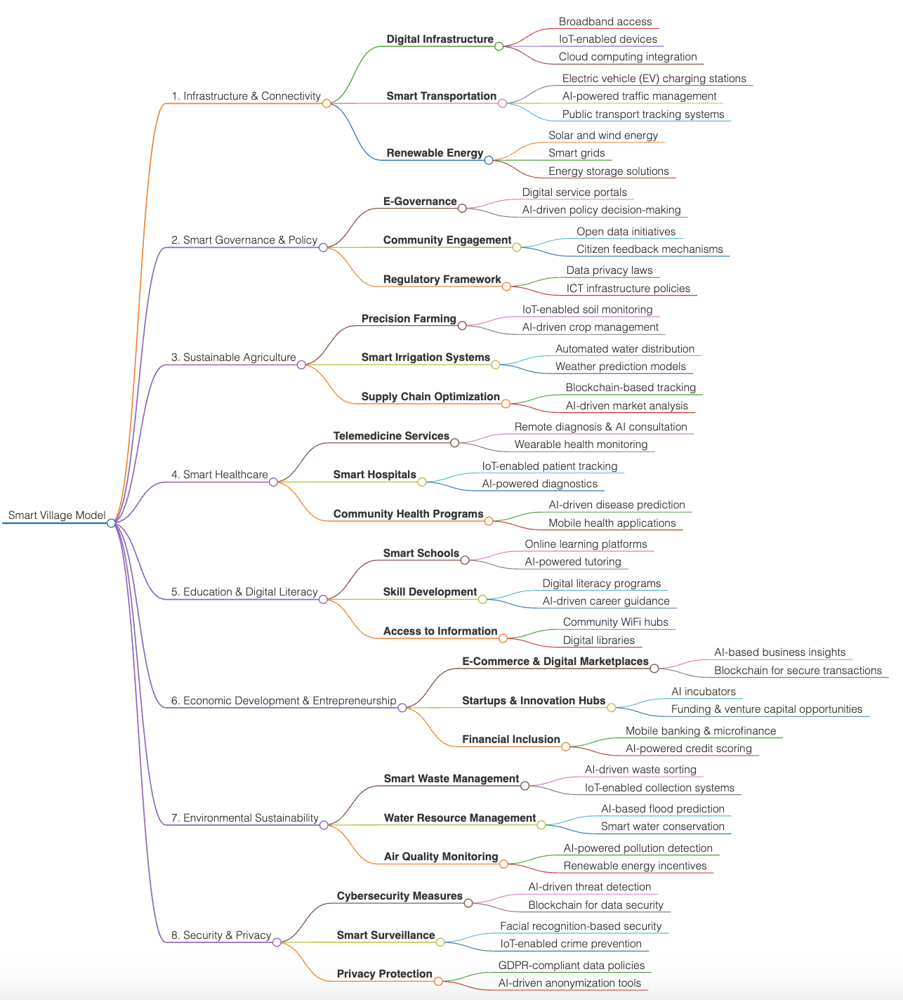

<a href="https://github.com/drshahizan/short-course/stargazers"></a>
<a href="https://github.com/drshahizan/short-course/network/members"></a>
<a href="https://github.com/drshahizan/short-course/pulls"></a>
<a href="https://github.com/drshahizan/short-course"></a>
<a href="https://github.com/drshahizan/short-course/graphs/contributors"></a>


# Brainstorming and Idea Generation: Markmap💡🧠

<a href="https://github.com/drshahizan/short-course/blob/main/workshop/25AIwriting">
 
</a>


## 1. Introduction
Markmap is a tool that visualizes markdown documents as interactive mind maps. It's useful for organizing and navigating complex information, making it easier to understand and explore the content. Here's how you can use Markmap:

## 2. Prompt to create a mind map
Please type this prompt in tools like Copilot, Gemini, and ChatGPT.

  ```
a mind map with a structured list that is centred on [Your Topic]. Create a Markdown version of the mind map.
Start with the primary concept that embodies the primary theme found in the data. Create primary branches based on
the identified categories or important subjects. Create thorough sub-branches that focus on certain data points,
patterns, or insights for every major branch. Make sure the linkages and hierarchies within the data are adequately
visualised in the mind map.
  ```

### Example: Smart Village Model

```
# Smart Village Model

## 1. Infrastructure & Connectivity
   - **Digital Infrastructure**
     - Broadband access
     - IoT-enabled devices
     - Cloud computing integration
   - **Smart Transportation**
     - Electric vehicle (EV) charging stations
     - AI-powered traffic management
     - Public transport tracking systems
   - **Renewable Energy**
     - Solar and wind energy
     - Smart grids
     - Energy storage solutions

## 2. Smart Governance & Policy
   - **E-Governance**
     - Digital service portals
     - AI-driven policy decision-making
   - **Community Engagement**
     - Open data initiatives
     - Citizen feedback mechanisms
   - **Regulatory Framework**
     - Data privacy laws
     - ICT infrastructure policies

## 3. Sustainable Agriculture
   - **Precision Farming**
     - IoT-enabled soil monitoring
     - AI-driven crop management
   - **Smart Irrigation Systems**
     - Automated water distribution
     - Weather prediction models
   - **Supply Chain Optimization**
     - Blockchain-based tracking
     - AI-driven market analysis

## 4. Smart Healthcare
   - **Telemedicine Services**
     - Remote diagnosis & AI consultation
     - Wearable health monitoring
   - **Smart Hospitals**
     - IoT-enabled patient tracking
     - AI-powered diagnostics
   - **Community Health Programs**
     - AI-driven disease prediction
     - Mobile health applications

## 5. Education & Digital Literacy
   - **Smart Schools**
     - Online learning platforms
     - AI-powered tutoring
   - **Skill Development**
     - Digital literacy programs
     - AI-driven career guidance
   - **Access to Information**
     - Community WiFi hubs
     - Digital libraries

## 6. Economic Development & Entrepreneurship
   - **E-Commerce & Digital Marketplaces**
     - AI-based business insights
     - Blockchain for secure transactions
   - **Startups & Innovation Hubs**
     - AI incubators
     - Funding & venture capital opportunities
   - **Financial Inclusion**
     - Mobile banking & microfinance
     - AI-powered credit scoring

## 7. Environmental Sustainability
   - **Smart Waste Management**
     - AI-driven waste sorting
     - IoT-enabled collection systems
   - **Water Resource Management**
     - AI-based flood prediction
     - Smart water conservation
   - **Air Quality Monitoring**
     - AI-powered pollution detection
     - Renewable energy incentives

## 8. Security & Privacy
   - **Cybersecurity Measures**
     - AI-driven threat detection
     - Blockchain for data security
   - **Smart Surveillance**
     - Facial recognition-based security
     - IoT-enabled crime prevention
   - **Privacy Protection**
     - GDPR-compliant data policies
     - AI-driven anonymization tools


This mind map provides a visual representation of the hierarchical structure of the primary theme and its related categories, ensuring that the linkages and hierarchies within the data are clearly illustrated. 
```

## 3. [MarkMap](https://markmap.js.org/repl)
Paste the Markdown code into [MarkMap](https://markmap.js.org/repl): Open Markmap and paste your copied markdown content. Markmap will automatically generate an interactive mind map based on the markdown structure.

**Example**: Amanat Naib Canselor

<p align="center">

</p>

## 4. Interact with Your Mind Map
You can expand or collapse branches, zoom in and out, and pan around to explore different parts of the mind map.

Remember, Markmap supports various markdown features such as:
- **Styling**: Apply bold, italic, strikethrough, and highlights to text.
- **Code Blocks**: Include code snippets or formulas.
- **Images and Links**: Embed images and create hyperlinks.

For a detailed guide and advanced features, you can refer to the [Markmap documentation](https://mindmapexpert.com/review/how-to-create-a-mind-map-using-markmap-js/) or visit the [Markmap GitHub repository](https://github.com/dundalek/markmap). Enjoy creating and navigating your mind maps


### 🙌🏻 Connect with Me
<p align="left">
    <a href="https://github.com/drshahizan" target="_blank"></a>
    <a href="https://www.linkedin.com/in/drshahizan" target="_blank"></a>
    <a href="mailto:shahizan@utm.my" target="_blank"></a>
    <a href="https://www.researchgate.net/profile/Mohd-Othman-28" target="_blank"></a>
    <a href="https://orcid.org/0000-0003-4261-1873" target="_blank"></a> 
 <a href="https://visitorbadge.io/status?path=https%3A%2F%2Fgithub.com%2Fdrshahizan" target="_blank"></a>
 

</p>
