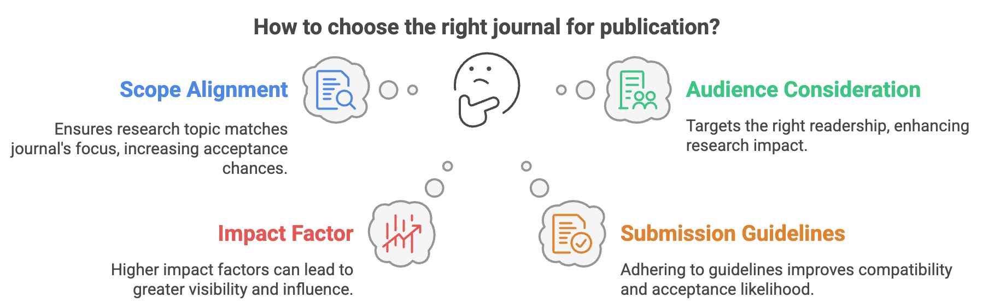

# 📌 Identifying a Suitable Journal for Your Research

Selecting the right journal is a **critical step** in the publication process, ensuring that your research reaches the correct audience and meets the **highest publication standards**. With the advancement of AI-powered tools, researchers can now efficiently match their manuscripts to **relevant, high-impact journals** based on various factors such as title, abstract, and keywords.

  
## 🎯 **How to Select the Right Journal?**
To maximize the impact of your research, consider the following key factors when selecting a journal:

### **1️⃣ Evaluate Journal Impact and Ranking**  
A journal's **impact factor** and ranking indicate its influence in the research community.  
✅ Use **[Scimago Journal & Country Rank (SJR)](https://www.scimagojr.com/)** to assess high-impact journals.

### **2️⃣ Find Journals Based on Your Abstract**  
Many AI-powered tools can analyze your **abstract** and suggest suitable journals.  
🔹 Recommended tools:  
- **[Elsevier Journal Finder](https://journalfinder.elsevier.com/)**  
- **[Springer Journal Suggester](https://journalsuggester.springer.com/)**  

### **3️⃣ Review Journal Submission Guidelines**  
Every journal has unique **author guidelines** and **submission criteria** that must be followed.  
📌 **Check for:**  
- Word limits  
- Formatting requirements  
- Open-access policies  
- Scope and topic alignment  

✅ **AI Tools to Assist in Journal Selection:**  
- **[Scimago (SJR)](https://www.scimagojr.com/)** – Identifies high-impact journals.  
- **[Elsevier Journal Finder](https://journalfinder.elsevier.com/)** – Matches manuscripts to relevant journals.  
- **[Springer Journal Suggester](https://journalsuggester.springer.com/)** – Suggests appropriate journals based on manuscript content.  

## 🔍 **AI-Powered Journal Selection Tools**
AI tools leverage **machine learning algorithms** to analyze the content of a manuscript and suggest the most appropriate journals for publication. These tools not only save time but also enhance the chances of acceptance by aligning submissions with journals that have previously published similar research.

| 🏆 No. | 🛠 **Tool Name** | 📖 **Description** |
| --- | ---------------- | ------------------ |
| 1️⃣ | [JANE (Journal/Author Name Estimator)](https://jane.biosemantics.org/) | A **free** bioinformatics tool that matches manuscripts to **MEDLINE-indexed** journals. It also helps identify potential reviewers and related papers. |
| 2️⃣ | [Elsevier Journal Finder](https://journalfinder.elsevier.com/) | Matches your paper's **title, abstract, or keywords** with Elsevier's **vast catalog** of journals. |
| 3️⃣ | [Wiley Journal Finder](https://journalfinder.wiley.com/search?type=match) | Suggests suitable Wiley journals based on **title and abstract**, covering **1,400+ hybrid and open-access** options. |
| 4️⃣ | [Edanz Journal Selector](https://www.edanz.com/journal-selector) | Compares **28,000+ journals** based on **impact factor, field of study, and publisher** to provide tailored recommendations. |
| 5️⃣ | [Springer Journal Suggester](https://journalsuggester.springer.com/) | Provides a list of **Springer journals** relevant to your manuscript’s subject. |
| 6️⃣ | [Publons](https://publons.com/) | Identifies journals that offer **peer review services** while tracking researcher contributions. |
| 7️⃣ | [Manuscript Matcher (Clarivate)](https://mjl.clarivate.com/manuscript-matcher) | Utilizes **Web of Science data** to suggest appropriate journals. |
| 8️⃣ | [SSRN](https://www.ssrn.com/index.cfm/en/) | A **social sciences research network** that aids in journal selection. |
| 9️⃣ | [JournalGuide](https://www.journalguide.com/) | Matches manuscripts to journals based on **topic and author preferences**. |
| 🔟 | [EndNote Match](https://support.clarivate.com/Endnote/s/article/EndNote-Manuscript-Matcher?language=en_US) | Uses **title and abstract** to suggest relevant journals. |

🚀 **Selecting the right journal enhances your chances of publication success!** Use AI-powered tools to streamline the process and ensure your research reaches the most impactful audience.

### 🙌🏻 Connect with Me

    
    
    
    
     
 
 

