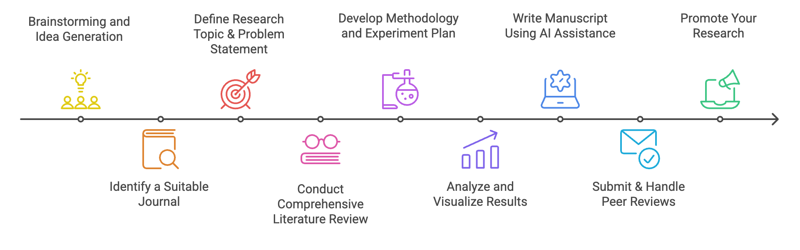

# 📌 A Step-by-Step Guide to Writing a **High-Impact Journal Article** Using AI Tools  

  

Publishing in a **high-impact journal** is a prestigious achievement requiring **originality, clarity, and high scientific rigor**. This guide provides a **structured breakdown of each step**, leveraging **AI tools** to enhance your workflow and **maximize efficiency**.  

## 📝 Step 1: [Brainstorming and Idea Generation](../brain)  

💡 **Why?** Generating and organizing **innovative research ideas** is crucial for **problem-solving, structuring research, and creative exploration**.  
🔍 **How AI Helps:** AI-powered brainstorming tools assist researchers in **visualizing, refining, and expanding** their thoughts through **mind mapping, structured thinking, and AI-driven suggestions**.  

✅ **AI Tools:**  
✔️ Mind Mapping & Visual Structuring  
✔️ Research & Idea Expansion  
✔️ Prompting & Automated Brainstorming  

## 📚 Step 2: [Identify a Suitable Journal](../journal)  

📌 **Why?** Selecting the right **academic journal** ensures your research reaches the **right audience**, **maximizes impact**, and **meets publication standards**.  
🤖 **How AI Helps:** AI tools efficiently match manuscripts to **high-impact journals** based on **title, abstract, keywords, and research field**.  

✅ **AI Tools:**  
✔️ Journal Recommendation  
✔️ Journal Selection & Research Indexing  

## 🎯 **Step 3: [Define Your Research Topic & Problem Statement](../research)  

🎯 **Why?** A well-defined research topic and problem statement are **fundamental** to academic success, ensuring **clarity, originality, and impact**.  
🤖 **How AI Helps:** AI-powered tools efficiently **identify knowledge gaps, generate research questions, and streamline literature reviews**.  

✅ **AI Tools:**  
✔️ Identify Knowledge Gaps in Existing Research  
✔️ Perform Literature Review & Analyze Research Trends  
✔️ Read and Summarize Peer-Reviewed Papers  
✔️ Generate & Refine Research Questions  

## 🔍 **Step 4: [Conduct a Comprehensive Literature Review & Systematic Literature Review (SLR)](../lr)  

📖 **Why?** A **well-structured literature review** forms the backbone of any research, ensuring **credibility, justification, and contextual relevance**.  
🤖 **How AI Helps:** AI tools facilitate **research discovery, reference management, citation analysis, and visualization of research trends**.  

✅ **AI Tools:**  
✔️ Discover Relevant Research Papers  
✔️ Reference Management & Citation Analysis  
✔️ Extracting & Summarizing Key Findings  
✔️ Visualizing Research Trends & Citation Networks  

## ⚙️ Step 5: [Develop Methodology and Experiment Plan](../methodology)  

📌 **Why?** A well-structured methodology ensures your research is **replicable, reliable, and scientifically sound**.  
🤖 **How AI Helps:** AI tools assist in **experiment planning, data preprocessing, model development, evaluation, and visualization**.  

✅ **AI Tools:**  
✔️ Dataset Preparation & Experiment Design  
✔️ Model Development & Algorithm Implementation  
✔️ Model Evaluation & Experiment Optimization  
✔️ Visualizing Methodology & Experimental Design  

## 📊 Step 6: [Analyze and Visualize Results](../analysis)  

📈 **Why?** A **structured analysis and visualization** of research results help in conveying findings **effectively, accurately, and comprehensively**.  
🤖 **How AI Helps:** AI-powered tools support **statistical analysis, data visualization, and research interpretation**.  

✅ **AI Tools:**  
✔️ Statistical Analysis & Data Processing  
✔️ Data Visualizations & Interactive Graphs  
✔️ Interpretation & Summarization  
✔️ Diagram Generation & Research Visualization  

## ✍️ Step 7: [Writing the Manuscript Using AI Assistance](../write)  

📝 **Why?** Writing a **high-quality research manuscript** requires **proper structuring, clarity, and adherence to academic standards**.  
🤖 **How AI Helps:** AI-powered tools assist in **drafting, refining, proofreading, and formatting** research papers.  

✅ **AI Tools:**  
✔️ Drafting Research Papers  
✔️ Language Enhancement & Proofreading  
✔️ Plagiarism Detection & Citation Formatting  
✔️ Research Paper Formatting & Submission  

## 📑 Step 8: [Submitting & Handling Peer Reviews](../submit)  

🛠️ **Why?** Proper submission formatting and **handling reviewer comments professionally** can **significantly improve** acceptance rates in **high-impact journals**.  
🤖 **How AI Helps:** AI tools aid in **submission tracking, journal selection, and refining manuscripts** based on peer review feedback.  

✅ **AI Tools:**  
✔️ Journal Selection & Manuscript Preparation  
✔️ Drafting Responses & Handling Peer Reviews  
✔️ Revising & Improving Manuscripts After Peer Review  
✔️ Submission Tracking & Workflow Management  

## 🚀 [Step 9: Promote Your Research](../promote)  

📢 **Why?** Increasing research visibility ensures **higher citations, global reach, and greater academic impact**.  
🤖 **How AI Helps:** AI-powered tools enhance **research discoverability, social media engagement, and citation tracking**.  

✅ **AI Tools:**  
✔️ Index Your Research in Academic Databases  
✔️ Share Your Research on Social & Professional Networks  
✔️ Create Visual Summaries & Research Highlights  
✔️ Publish Blog Posts & Research Summaries  

🔗 **Need More?** Check out the full workshop resources **[here](https://github.com/drshahizan/short-course/blob/main/workshop/25AIwriting)**  

### 🙌🏻 Connect with Me

    
    
    
    
     
 
 

