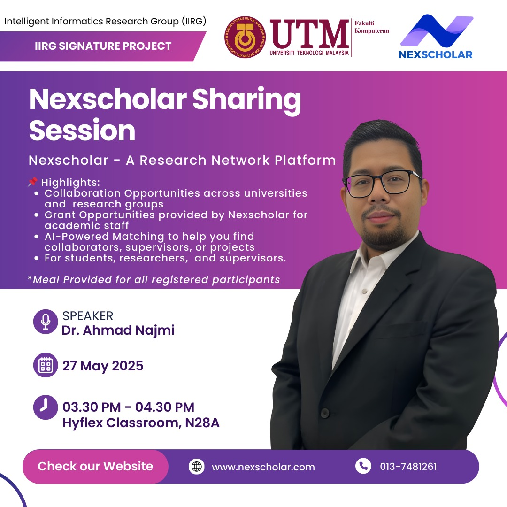

# 🚀 Nexscholar: A Research Network Platform

  

In an increasingly interconnected academic world, collaboration and visibility are key to impactful research. This workshop, **"Nexscholar: A Research Network Platform"**, introduces participants to a powerful digital platform designed to revolutionize the way researchers connect, collaborate, and secure funding.

Led by **Dr. Ahmad Najmi Amerhaider Nuar**, the session will explore how **Nexscholar** harnesses the power of **AI-driven matching tools** to help academics find the right research partners, supervisors, students, and funding opportunities. Participants will also learn how to showcase their work, manage their research profile, and join a growing network of scholars across disciplines and institutions.

## Key highlights

* Access to **exclusive research grants** for academic staff
* **AI-powered collaboration matching** with researchers and industry partners
* Tools for managing and promoting research visibility
* Opportunities to engage in multi-institutional and cross-border collaborations

## 🔗 Registration

👉 **Register now:** [https://forms.gle/hg7th4WKeMhzMD6v9](https://forms.gle/hg7th4WKeMhzMD6v9)

## 🌐 More Information

- 🌍 **Website:** [www.nexscholar.com](http://www.nexscholar.com)  
- 📞 **Contact:** +60 13-748 1261  

Let’s build a smarter, more connected research future — **together**. 🤝📚💡

This workshop is ideal for **academicians**, **research officers**, **postgraduate students**, and **institutional research leaders** who aim to expand their research network and increase their impact within the global research ecosystem.

### 🙌🏻 Connect with Me

    
    
    
    
     
 
 

