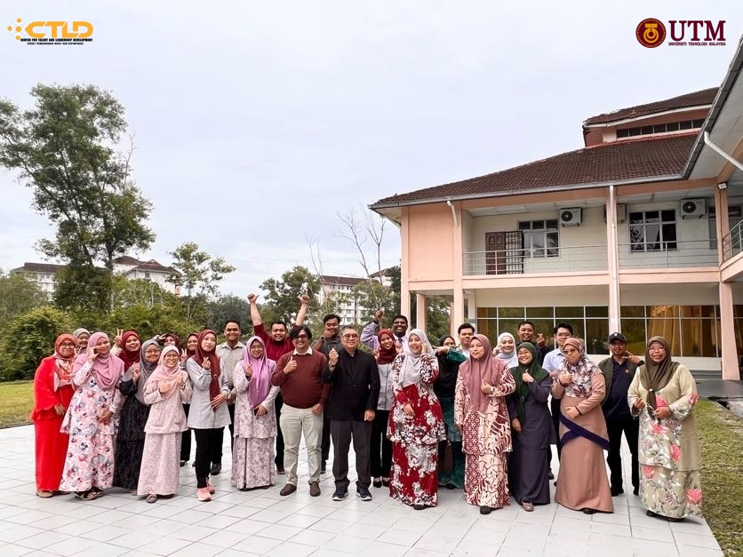
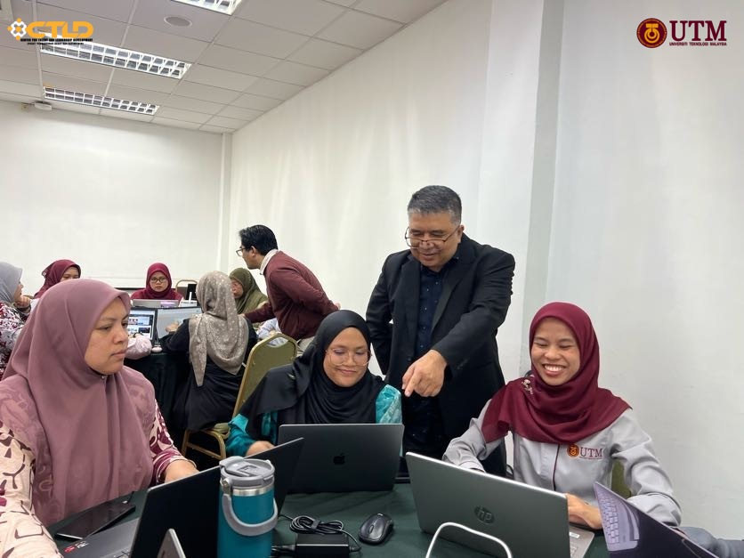
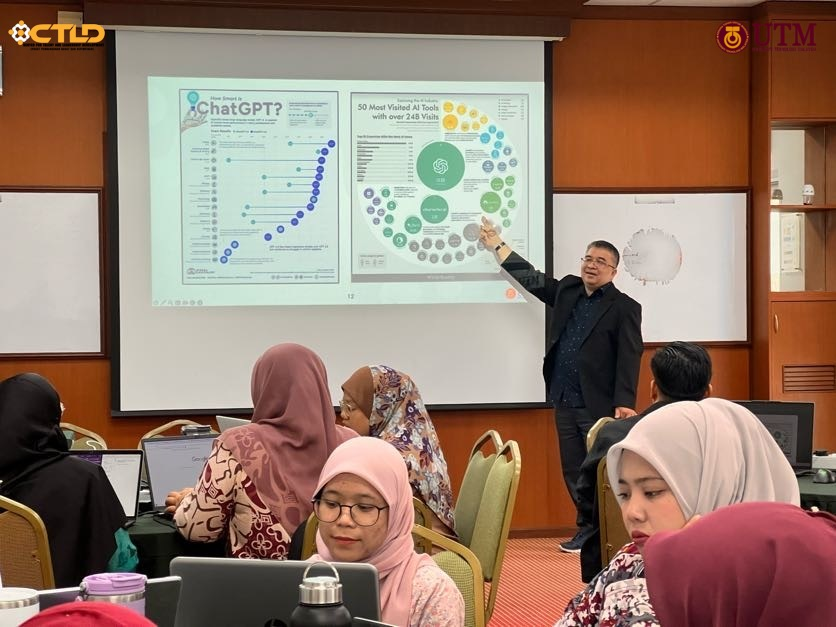
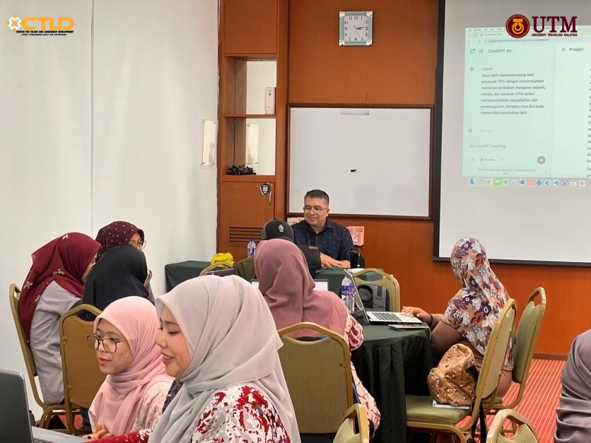
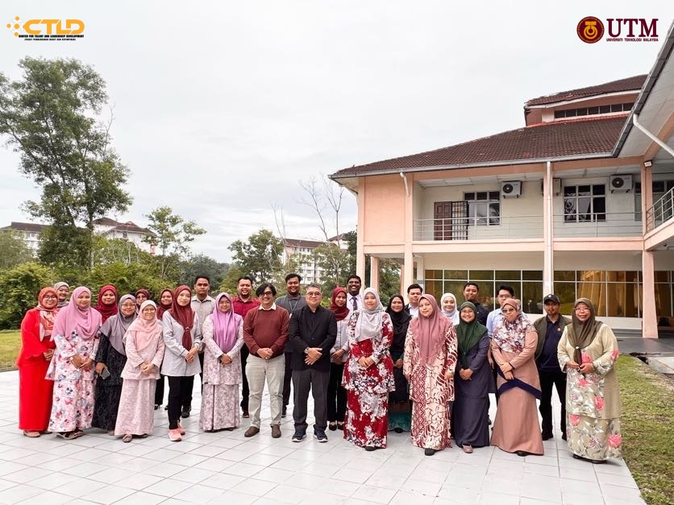

# Generatif AI: Memudahkan Aktiviti Harian

 
 

Kursus ini bertujuan untuk memperkenalkan konsep dan aplikasi kecerdasan buatan generatif dalam mempermudah tugas harian. Kursus ini merupakan sebahagian daripada inisiatif **Kompetensi Strategik Universiti (Digital Kompetensi)** yang menekankan keperluan penguasaan teknologi digital di kalangan warga akademik dan profesional. Sepanjang kursus ini, peserta akan diperkenalkan kepada teknologi **AI generatif**, termasuk penggunaannya dalam automasi kerja, penulisan kandungan, analisis data, serta integrasi dengan peralatan digital seperti Google Workspace dan perisian lain yang menyokong produktiviti. Selain itu, sesi ini juga akan membincangkan etika dan cabaran dalam penerapan AI generatif dalam kehidupan seharian.

**Butiran Kursus:**
- 📍 **Lokasi:** Integrity Room, CTLD, UTM Johor Bahru  
- 📅 **Tarikh:** 5 Februari 2025 (Rabu)  
- 🕚 **Masa:** 11.00 pagi - 5.00 petang  

**Penceramah:**  
👨‍🏫 *Prof. Madya Ts. Mohd Shahizan bin Othman*  
Fakulti Komputeran, UTM Johor Bahru  

Program ini dianjurkan oleh **CTLD** dan sesuai untuk pensyarah, penyelidik, pelajar, serta kakitangan akademik yang ingin meneroka potensi AI generatif dalam meningkatkan produktiviti dan inovasi dalam pendidikan serta pentadbiran.

## Gambar

 

## Bahan Pengajaran

| No | Pelajaran | Topik |
|--------|---------|---------|
| 1.| Slaid |[Generatif AI: Memudahkan Aktiviti Harian](https://liveutm-my.sharepoint.com/:b:/g/personal/shahizan_live_utm_my/EbrZhFzwAQZCsb5q2Y4Jq6cBXX09SsSFbBfQI5gvtoy7Rg?e=B7B5Q4)
| 2.| Artikel |[Generative AI Global Interest Report 2023](https://www.electronicshub.org/generative-ai-global-interest-report-2023/)
| 3. | Pemasangan & Log masuk |[ChatGPT, Copilot, Gemini](https://github.com/drshahizan/ai-tools/blob/main/materials/untw/signin.md)|
| 4. | WhatsApp |[ChatGPT, Copilot](wa-chatgpt.md)|
| 5. | Telegram |[Copilot](telegram.md)|
| 6. | Alatan Gen AI |[DeepSeek](https://github.com/drshahizan/short-course/blob/main/25ctld/deepseek.md)|
|  |  |[Qwen](https://github.com/drshahizan/short-course/edit/main/25ctld/qwen.md)|
|  |  |[Kimi](https://github.com/drshahizan/short-course/blob/main/25ctld/kimi.md)|
|  |  |[Napkin.ai](https://github.com/drshahizan/short-course/blob/main/25ctld/napkin.md)|
|7.  | Latihan | [Latihan 1: Penggunaan arahan Generatif AI](https://github.com/drshahizan/ai-tools/blob/main/materials/untw/fungsi.md)|
|  |  | [Latihan 2: Analisa dokumen menggunakan Copilot](https://github.com/drshahizan/ai-tools/blob/main/materials/untw/dokumen_copilot.md)|
|  |  | [Latihan 3: MarkMap](https://github.com/drshahizan/ai-tools/blob/main/materials/pimpin/markmap.md)|
|  |  | [Latihan 4: Analisa imej menggunakan ChatGPT](https://github.com/drshahizan/ai-tools/blob/main/materials/untw/dokumen_untw.md)|
|  |  | [Latihan 5: Analisa fail csv menggunakan ChatGPT](https://github.com/drshahizan/ai-tools/blob/main/materials/untw/dokumen_chatgpt.md)|
|  |  | [Latihan 6: Malaysian Cultural Artistry](https://github.com/drshahizan/Generative-AI-Playground/blob/main/materials/drawing.md) |
|  |  | [Think Machine: Multidimensional Mind Mapping](https://thinkmachine.com/) |
|8.  | Arahan | [Kerangka kerja Rantaian Pemikiran (CoT)](https://github.com/drshahizan/ai-tools/blob/main/materials/gen_frame/1cot.md)|
|  |  | [Kerangka kerja RTF: _Role_, _Task_, dan _Format_](https://github.com/drshahizan/ai-tools/blob/main/materials/gen_frame/2rtf.md)|
|  |  | [Kerangka kerja BAB: _Before_, _After_, _Bridge_](https://github.com/drshahizan/ai-tools/blob/main/materials/gen_frame/3bab.md)|
|  |  | [Kerangka kerja TAG: _Task, Action, Goal_](https://github.com/drshahizan/ai-tools/blob/main/materials/gen_frame/4tag.md)|
|  |  | [Kerangka kerja CARE: _Context, Action, Result, Example_](https://github.com/drshahizan/ai-tools/blob/main/materials/gen_frame/5care.md)|
|  |  | [Kerangka kerja RISE: _Role, Input, Steps, Expectation_](https://github.com/drshahizan/ai-tools/blob/main/materials/gen_frame/6rise.md)|
|  |  | [ChatGPT Prompts For Research Papers](https://github.com/drshahizan/Generative-AI-Playground/blob/main/materials/prompt_research.md)|
|  |  | [ChatGPT Prompts for Academic Writing](https://github.com/drshahizan/Generative-AI-Playground/blob/main/materials/prompt_academic.md)|
| |  | [Effective prompts](https://drshahizan.gitbook.io/copywriting-chatgpt/prompts/effective-prompts)|
|  |  | [ChatGPT Expert Prompts](https://github.com/drshahizan/Generative-AI-Playground/blob/main/materials/prompt.md)|
|  |  | [215+ ChatGPT Prompts & How to Write your Own](https://writesonic.com/blog/chatgpt-prompts)|
|  |  | [Chat with Copilot regarding the PDF file](https://github.com/drshahizan/Generative-AI-Playground/blob/main/materials/copilot.md)|

## Maklumat Tambahan

| No | Pelajaran | Topik |
|--------:|---------|---------|
|1. | Pengenalan AI|[Stunning AI shows how it would kill 90%. w Elon Musk](https://youtu.be/J6Mdq3n6kgk?si=4G0k5-WNH55pBMhw)|
|||[Artificial Intelligence: 60 Minutes ](https://youtu.be/aZ5EsdnpLMI?si=3aEFdMyTnOWZTuCZ)|
||| [Pengenalan Kepada Artificial Intelligence (AI)](https://youtu.be/kms0WrEbs0Q?si=woVk00RDgFNC5rBd)|
| 2. | Aplikasi AI | [askLAYLA](https://justasklayla.com/) |
|||[Trip Planner AI](https://tripplanner.ai/)|
||| [Penyampai Radio AI Yang Pertama Di Malaysia](https://says.com/my/seismik/kenali-aina-sabrina-dj-fly-fm-juga-ai-yang-pertama-di-malaysia-sebagai-penyampai-radio)|
|||[Sora](https://openai.com/sora)|
||| [10 Website AI Terbaik Buat Kamu Gunakan di 2024](https://www.facebook.com/reel/671923085023778) |
||| [Mudah banget buat video cerita kartun animasi 3D pakai](https://www.youtube.com/watch?v=6IYBxbpKato)|
||| [Cara Bikin Konten AI VIRAL dengan Bing Chat + CapCut](https://youtu.be/ed30BLkVpis?si=Z6XmTWxVO1PC_kyv)|
||| [10 Best AI Presentation Generators](https://www.unite.ai/best-ai-presentation-generators/)|

### 🙌🏻 Connect with Me

    
    
    
    
     
 
 

