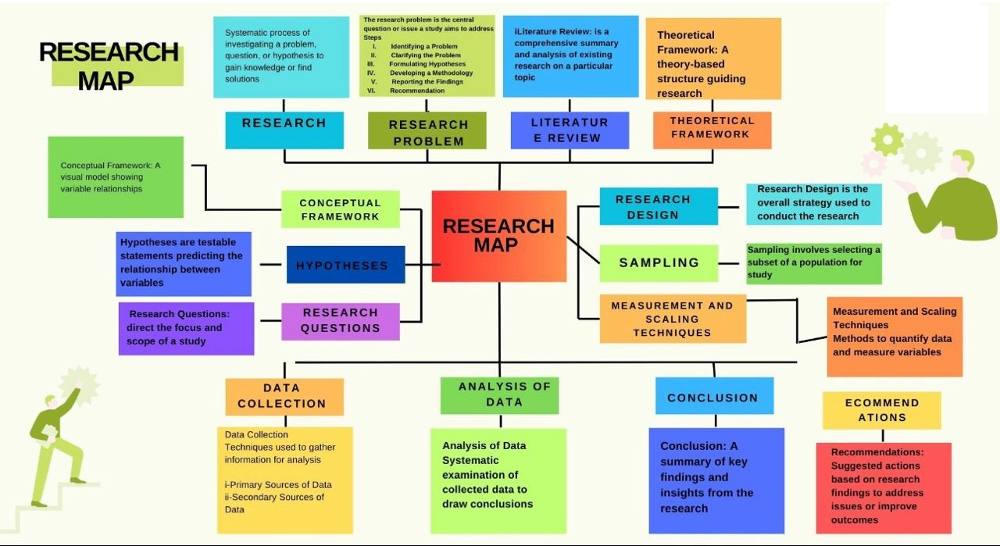

# Research MAP: A Detailed Guide to Structuring Your Research Process

 

The Research MAP serves as a visual and systematic framework to guide researchers through each phase of the research process, from identifying problems to making actionable recommendations.

### **1. Research 🧠**
A **systematic process** to investigate a problem, question, or hypothesis, aiming to gain knowledge or find practical solutions.

#### **Types of Research**:
- **Quantitative Research 📊** (focused on measurable data):
  1. **Descriptive Research**: Observes and describes characteristics of a phenomenon.
  2. **Correlational Research**: Explores relationships between variables.
  3. **Quasi-Experimental Research**: Examines cause-effect relationships without random assignment.
  4. **Experimental Research**: Tests hypotheses with controlled experiments.
  5. **Survey Research**: Gathers data through questionnaires and surveys.
  6. **Causal-Comparative Research**: Compares groups to identify cause-effect relationships.
  7. **Longitudinal Research**: Studies variables over extended periods.
  8. **Cross-Sectional Research**: Examines data at a single point in time.

- **Qualitative Research 📖** (focused on understanding phenomena):
  1. **Ethnographic Research**: Studies cultural practices and behaviors.
  2. **Phenomenological Research**: Explores lived experiences of individuals.
  3. **Grounded Theory**: Develops theories grounded in data.
  4. **Case Study Research**: Examines specific cases in-depth.
  5. **Narrative Research**: Analyzes stories and personal accounts.
  6. **Action Research**: Focuses on solving immediate problems.

### **2. Research Problem ❓**
The **core issue or question** your research aims to address.

#### **Steps to Address a Research Problem**:
1. **Identify the Problem**: What is the central issue or gap? 🕵️‍♂️  
2. **Clarify the Problem**: Define it in detail to avoid ambiguity.  
3. **Formulate Hypotheses**: Develop testable predictions.  
4. **Develop a Methodology**: Design a plan to address the problem.  
5. **Report Findings**: Present results with clarity. 📑  
6. **Make Recommendations**: Suggest solutions or future research directions.

### **3. Literature Review 📚**
A **comprehensive summary and analysis** of existing research on a topic. It helps:
- Identify gaps in knowledge.
- Provide context for your study.
- Avoid duplication of work.

### **4. Theoretical Framework 🏛️**
A **theory-based structure** that underpins your research, guiding your approach and analysis. Examples include behavioral theories, social constructs, or economic models.

### **5. Conceptual Framework 🗂️**
A **visual model** illustrating relationships between variables in your study. It acts as a roadmap for understanding how concepts interact.

### **6. Hypotheses 🧪**
**Testable statements** predicting relationships between variables.

#### **Types of Hypotheses**:
- **Null Hypothesis (H₀)**: Assumes no effect or relationship.
- **Alternative Hypothesis (H₁)**: Suggests a specific effect or relationship.

### **7. Research Questions 🧐**
Direct the **focus and scope** of your study. They are precise inquiries that guide your methodology and data analysis.

### **8. Research Design 🛠️**
The **overall strategy** for conducting research. It ensures that your methods align with your objectives.

#### **Key Components**:
1. **Purpose**: What is the aim of the study? 🎯  
2. **Philosophical Assumption**: What are your underlying beliefs?  
3. **Research Approach**: Quantitative, qualitative, or mixed methods?  
4. **Methodological Choice**: Select appropriate tools and techniques.  
5. **Research Strategy**: Case study, survey, experiment, etc.  
6. **Sampling Method**: Decide how to select participants.  
7. **Data Collection**: Determine what data to gather and how.  
8. **Nature of Data Collected**: Quantitative, qualitative, or both?  
9. **Data Analysis Methods**: Statistical, thematic, or other analytical tools.

### **9. Sampling 🎯**
The process of **selecting a subset** of the population for your study.

#### **Types of Sampling**:
- **Probability Sampling**:
  - Simple Random Sampling 🎲  
  - Stratified Random Sampling  
  - Systematic Sampling  
  - Cluster Sampling  

- **Non-Probability Sampling**:
  - Convenience Sampling  
  - Purposive Sampling  
  - Snowball Sampling ❄️  
  - Quota Sampling  

### **10. Measurement and Scaling Techniques 📏**
Methods to **quantify data** and measure variables.

#### **Types of Scales**:
1. **Nominal Scale**: Categorical data (e.g., gender).  
2. **Ordinal Scale**: Ranked data (e.g., education level).  
3. **Interval Scale**: Data with equal intervals but no true zero (e.g., temperature).  
4. **Ratio Scale**: Data with a true zero (e.g., weight).  

### **11. Data Collection 📝**
Techniques used to **gather information** for analysis.

- **Primary Sources**: Data collected firsthand (e.g., surveys, experiments).  
- **Secondary Sources**: Pre-existing data (e.g., books, databases).  

### **12. Analysis of Data 📊**
A **systematic examination** of collected data to draw meaningful conclusions. Analytical methods can include statistical tests, thematic analysis, and data visualization.

### **13. Conclusion 🏁**
A **summary of key findings** and insights from your research. This section ties back to your research objectives and answers your research questions.

### **14. Recommendations 💡**
Propose **actionable steps** or future research directions based on your findings to address issues or improve outcomes.

This detailed Research MAP provides a clear and comprehensive framework for conducting rigorous and impactful research, ensuring that each step is carefully planned and executed. 🚀

### 🙌🏻 Connect with Me

    
    
    
    
     
 
 

