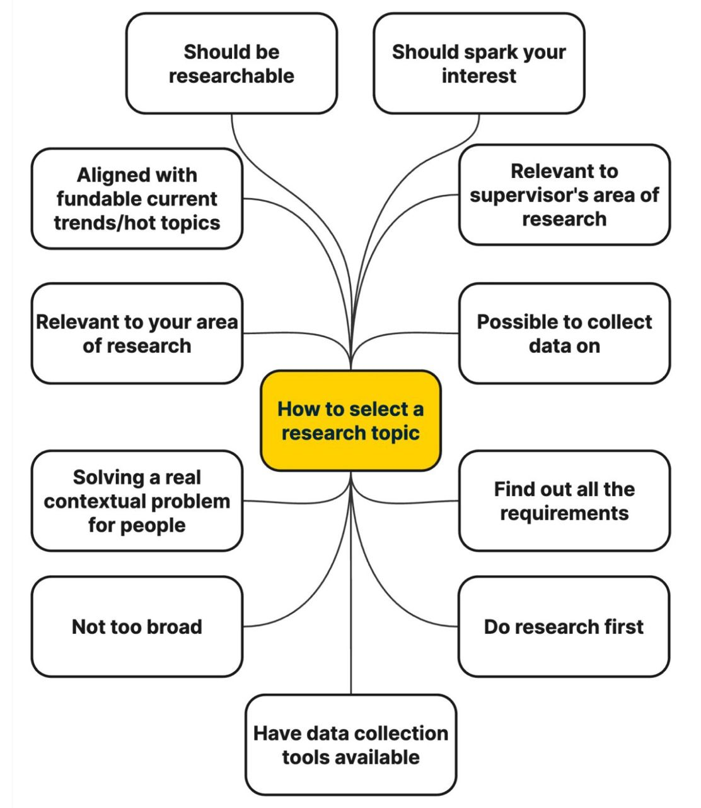

# How to Pick a Winning Research Topic

 

Choosing the right research topic is critical to the success of your academic journey. Here’s a step-by-step guide to selecting a topic that’s impactful, practical, and aligned with your interests and goals.

### **1. Start with Current Trends 📈**
Look at the **latest developments** in your field to identify promising areas of research.
- **Action Steps**:
  - Review top journals, conference proceedings, and publications from the last 2 years.
  - Identify **unsolved problems** or recurring themes.
  - Pinpoint **hot topics** that align with current funding opportunities.  
- **Example**: If AI ethics is trending, focus on a specific challenge, such as **bias mitigation in decision-making systems**.

### **2. Align with Your Supervisor 🤝**
Choosing a topic that aligns with your supervisor’s expertise ensures better guidance and collaboration.
- **Why?**
  - A **shared area of interest** creates a win-win situation.
  - Supervisors are more likely to support topics they are familiar with.  
- **Action Steps**:
  - Schedule a meeting with your supervisor to discuss potential ideas.
  - Align your topic with their ongoing projects or previous research areas.

### **3. Define Clear Boundaries 🎯**
A good research topic should be **specific and focused**. Avoid overly broad topics that lack depth.
- **Action Steps**:
  - Break down a broad idea into smaller, manageable subtopics.
  - Ensure the scope of your topic is achievable within the timeframe and resources available.  
- **Example**:
  - Instead of studying "AI in healthcare," focus on **“AI-driven predictive analytics for improving maternal healthcare in rural areas.”**

### **4. Map Required Resources 🛠️**
Consider the **practical resources** your research will need.  
- **Action Steps**:
  - Create a checklist of requirements such as:
    - **Lab equipment** 🧪
    - **Collaborators** 👥
    - **Specialized software** 💻
    - **Funding opportunities** 💰  
  - Ensure resources are available and accessible before committing to a topic.  
- **Why?**
  - Missing or unavailable resources can delay or derail your research progress.

### **5. Validate the Practical Impact of Your Idea 🌍**
Ensure your research solves **real-world problems** and has tangible benefits.
- **Action Steps**:
  - Engage with practitioners, industry experts, or community leaders in your field.
  - Ask them about their biggest challenges and gaps in current solutions.
  - Validate your idea’s **relevance** by assessing its potential for implementation.  
- **Example**:
  - Instead of theoretical work, focus on practical applications such as **developing a mobile app for remote health monitoring.**

### **Key Takeaways:**
A winning research topic is:
- **Relevant** to current trends 📰  
- **Aligned** with your supervisor’s expertise 🎓  
- **Specific** in scope 🔍  
- **Practical** with clear resources and actionable outcomes ⚙️  
- **Impactful** for solving real-world challenges 🌟  

By following these steps, you’ll ensure your research is both significant and manageable, setting the stage for academic success. 🚀

### 🙌🏻 Connect with Me

    
    
    
    
     
 
 

