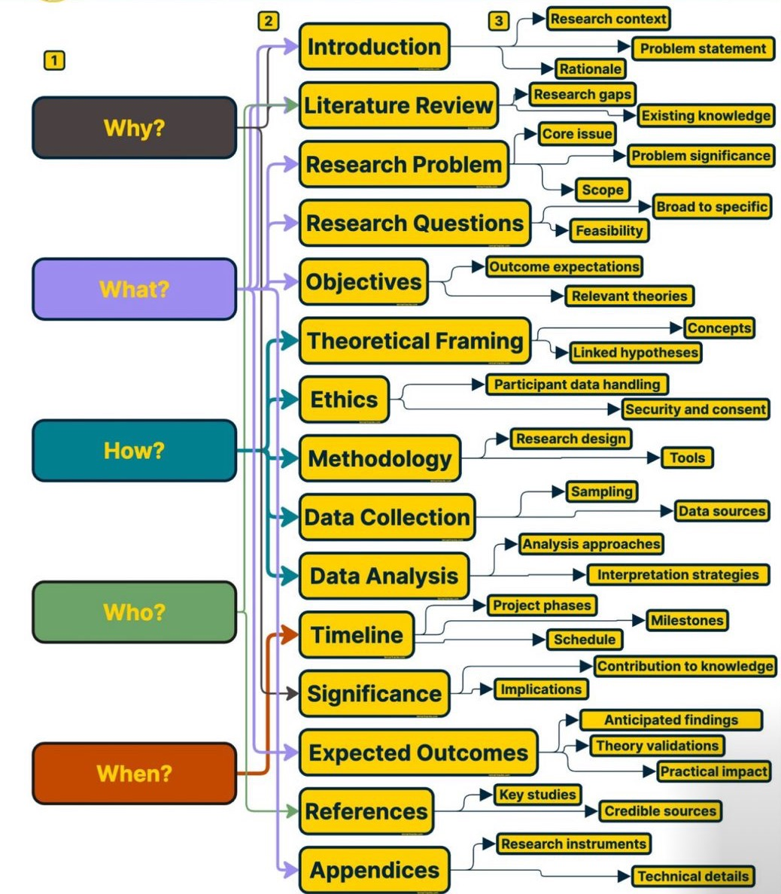

# Mastering the "Why-What" Sequence: A Step-by-Step Guide for Your Thesis

 

Most researchers struggle with structuring their thesis introduction effectively, but following the **"Why-What" sequence** ensures clarity, engagement, and a logical flow. Here’s a detailed 15-part structure broken into **7 broad steps** to guide your thesis writing process. Each step is designed to answer the core questions: **Why? What? How? Who? When?**  

### **1. Start with Why it Matters in Context 🧐**
Your research needs to establish its importance right from the start. Hook your readers by explaining **why your study matters** in a broader context.
- **Include**:
  - **Research Purpose**: Clearly define the aim of your research.
  - **Significance**: Explain how your study contributes to solving a problem or advancing knowledge.  
- **Why?**: This step establishes the **relevance** of your study.

### **2. Back Up Claims with Literature 📚**
Support your research’s importance by mapping the existing body of knowledge. This shows the **foundation for your work**.
- **Include**:
  - **Existing Knowledge**: Summarize key studies and established findings in your field.
  - **Research Gaps**: Identify what’s missing in the literature to justify your research.  
- **Why?**: Literature review validates the **necessity** of your study and positions it within the academic conversation.

### **3. Define Your Focus 🎯**
Drill down into **specifics** to guide your research framework. This is where you make your study’s focus clear.  
- **Include**:
  - **Research Problem**: The key issue or question your study addresses.
  - **Research Questions**: Specific inquiries that guide your investigation.
  - **Objectives**: The outcomes your research aims to achieve.  
- **What?**: These sections provide the **direction** and **scope** of your study.

### **4. Plan Your Approach 🛠️**
Detail **how you will conduct your research** by selecting theoretical and methodological frameworks.
- **Include**:
  - **Theoretical Framing**: The concepts and theories your study builds on.
  - **Methodology**: Your research design, tools, and techniques.
  - **Data Collection Strategy**: Specify sampling methods and data sources.  
- **How?**: This explains your **research blueprint**.

### **5. Get Practical ⚙️**
Address the **practicalities and ethics** involved in conducting your research.
- **Include**:
  - **Data Analysis**: Describe how you will interpret and analyze your data.
  - **Ethics**: Address participant data handling, consent, and security considerations upfront.  
- **Who?**: These sections highlight **participant involvement** and the ethical standards of your research.

### **6. Look Ahead 🔮**
Prepare for the **future outcomes and impact** of your research.
- **Include**:
  - **Timeline**: Outline project phases, milestones, and schedules.
  - **Significance**: Highlight the broader implications of your work.
  - **Expected Outcomes**: Anticipate findings, validate theories, and predict the practical impact.  
- **When?**: These steps outline the **timing and implications** of your study.

### **7. Finish Strong 💪**
Conclude your thesis with supporting material and references to ensure credibility.
- **Include**:
  - **References**: Cite credible sources that support your research.
  - **Appendices**: Provide additional information, such as research instruments and technical details.  
- **How & What?**: These sections complete your thesis by reinforcing **accuracy** and **completeness**.

### **Why Does This Structure Work?**
This approach flows from **broad context** to **specific details**, ensuring logical progression and clarity. By answering key questions (**Why? What? How? Who? When?**), it engages readers, aligns research components, and guarantees a thorough, impactful thesis.

### **💡 Pro Tip**:  
Use this structure to plan each section of your thesis in advance. This framework not only helps organize your thoughts but also improves coherence and readability, making your work stand out. 🚀

### 🙌🏻 Connect with Me

    
    
    
    
     
 
 

