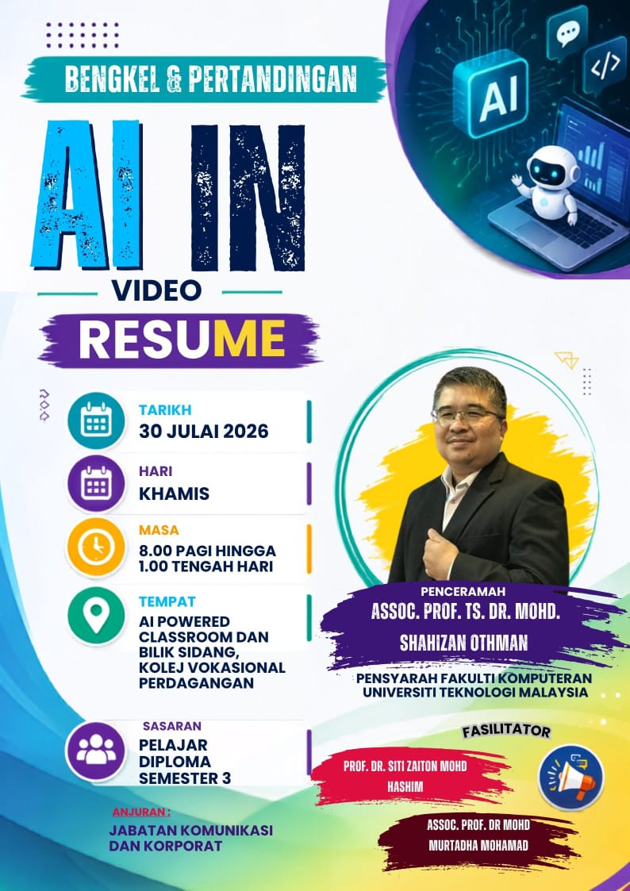

# AI in Video Resume: Creating Professional Video Resumes with Generative AI

  

- **📅 Date:** 30 July 2026 (Thursday)
- **🕗 Time:** 8:00 AM – 1:00 PM
- **📍 Venue:** AI Powered Classroom and Meeting Room, Kolej Vokasional Perdagangan
- **👨‍🏫 Instructor:** Assoc. Prof. Ts. Dr. Mohd Shahizan Othman
- **🤝 Facilitators:** Prof. Dr. Siti Zaiton Mohd Hashim and Assoc. Prof. Dr. Mohd Murtadha Mohamad
- **👥 Target Participants:** Diploma Semester 3 Students
- **🏢 Organiser:** Jabatan Komunikasi dan Korporat

## 📖 Synopsis

The **AI in Video Resume** workshop introduces students to the practical use of **Generative AI** in creating a professional and engaging video resume.

Participants will learn how to use AI tools to identify their strengths, develop personal branding, write a concise self-introduction, generate a professional script, and produce a short video resume. The workshop focuses on practical activities that can be completed within a limited period.

Through three focused sessions, participants will use ChatGPT and selected multimedia tools to transform their academic background, technical skills, achievements, and career aspirations into a compelling video resume. They will also learn basic recording, visual presentation, captioning, and video-editing techniques.

By the end of the workshop, each participant or team will produce a short **AI-assisted video resume** suitable for internship, job, scholarship, or professional portfolio applications.

# 🗂️ Content Overview

| No. | Category | Resources |
|:---:|----------|-----------|
| 1 | Learning Materials | • Introduction to Generative AI   • Personal Branding and Video Resume   • Prompt Engineering for Script Writing   • Basic Video Production and Editing |
| 2 | AI Applications | • [ChatGPT](https://chatgpt.com/)   • [Gemini](https://gemini.google.com/app)   • [Qwen](https://chat.qwen.ai/)   • [Canva](https://www.canva.com/)   • [CapCut](https://www.capcut.com/) |
| 3 | Final Output | • Video Resume Script   • Recorded or AI-Assisted Video Resume   • Final Submission for Competition |

## 🟦 [Session 1: Personal Branding, Script Writing & Storyboard Design](materials/s1.md)

Participants will learn how to build a strong personal brand and use Generative AI to plan an effective video resume.

> ✍️ **Main Output:** A complete **Video Resume Script** and **Storyboard** ready for production.

## 🟩 [Session 2: AI Content Creation for Video Resume](materials/s2.md)

Participants will create all multimedia assets required for their video resumes using AI-powered tools.

> 🎨 **Main Output:** A complete set of **AI-generated multimedia assets** for the video resume.

## 🟥 [Session 3: Video Resume Production with AI](materials/s3.md)

Participants will combine their scripts and multimedia assets into a professional one-minute video resume.

> 🎥 **Main Output:** A completed **One-Minute AI-Assisted Video Resume** ready for submission.

### 🙌🏻 Connect with Me

    
    
    
    
     
 
 

