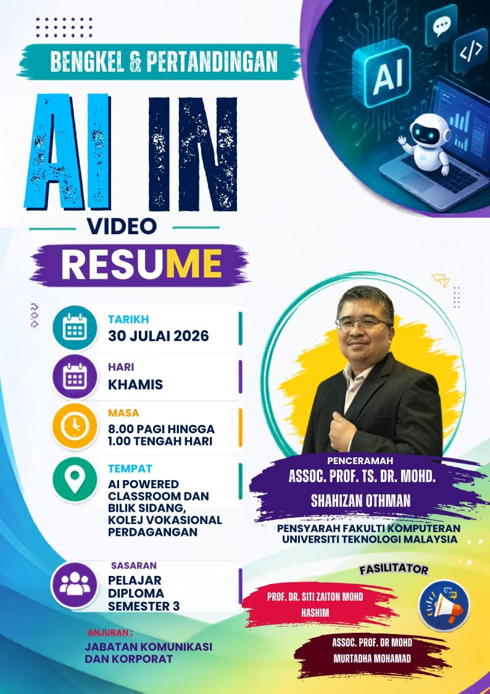

# 🎬 AI in Video Resume

## Creating Professional Video Resumes with Generative AI

  

  <strong>Discover Your Strengths • Build Your Story • Create Your Future</strong>

## 📌 Workshop Information

| Item | Details |
|---|---|
| 📅 **Date** | 30 July 2026 (Thursday) |
| 🕗 **Time** | 8:00 AM – 1:00 PM |
| 📍 **Venue** | AI-Powered Classroom and Meeting Room, Kolej Vokasional Perdagangan |
| 👨‍🏫 **Instructor** | Assoc. Prof. Ts. Dr. Mohd Shahizan Othman |
| 🤝 **Facilitators** | Prof. Dr. Siti Zaiton Mohd Hashim and Assoc. Prof. Dr. Mohd Murtadha Mohamad |
| 👥 **Target Participants** | Diploma Semester 3 Students |
| 🏢 **Organiser** | Jabatan Komunikasi dan Korporat |

> **Workshop Challenge:** Produce a compelling **two-minute AI-assisted video resume** that presents the best version of you.

## 📖 Workshop Synopsis

The **AI in Video Resume** workshop introduces students to the practical use of **Generative Artificial Intelligence** in creating professional, creative, and engaging video resumes.

Participants will learn how to identify their strengths, shape a personal brand, develop a concise script, plan a storyboard, generate consistent visuals, and assemble a complete video. The workshop combines guided instruction with hands-on activities using ChatGPT, Gemini, Qwen, Google Flow, Dola, Canva, and CapCut.

Working individually or in teams, participants will transform their academic background, technical skills, achievements, and career aspirations into a focused video resume for internship, employment, scholarship, competition, or professional portfolio purposes.

## 🎯 Learning Outcomes

By the end of the workshop, participants will be able to:

1. Explain the role of Generative AI in professional content and video production.
2. Develop a clear personal brand based on strengths, skills, achievements, and career aspirations.
3. Write effective prompts and a concise script for a two-minute video resume.
4. Design a master storyboard and divide it into manageable video segments.
5. Produce and combine AI-assisted scenes into a polished final video.
6. Evaluate a video resume based on content, creativity, visual quality, AI use, and professionalism.

## 🧭 Workshop Journey

| Stage | Focus | Key Output |
|:---:|---|---|
| **1** | Idea and Planning | Theme, target audience, key message, and role allocation |
| **2** | Storyboard Development | Story structure, scenes, dialogue, and visual direction |
| **3** | Master Storyboard | Complete two-minute storyboard |
| **4** | Segment and Assign | Ten-second segments assigned to team members |
| **5** | Video Production | Consistent AI-generated or recorded video segments |
| **6** | Merge and Refine | Final editing, captions, audio, transitions, and quality checks |

## 🗓️ Programme Overview

| Time | Session | Activities |
|---|---|---|
| **8:00 – 8:30 AM** | Registration and Briefing | Participant registration, workshop overview, and challenge briefing |
| **8:30 – 9:30 AM** | Session 1: Generative AI and Video Resume | Generative AI landscape, professional video resumes, personal branding, and responsible AI use |
| **9:30 – 10:45 AM** | Session 2: Prompting, Script, and Storyboard | Prompt design, script writing, character consistency, visual direction, camera, lighting, emotion, and storyboard planning |
| **10:45 – 11:00 AM** | Break | Refreshment and team preparation |
| **11:00 AM – 12:30 PM** | Session 3: Video Production | Generate or record scenes, create captions, edit video, add audio, and combine segments |
| **12:30 – 1:00 PM** | Showcase and Submission | Final screening, peer feedback, quality check, and submission |

## 💡 Suggested Competition Themes

### Theme 1 — Hire Me: The Best Version of Me

Present your strongest qualities, technical abilities, achievements, personality, and value to a future employer.

### Theme 2 — From Classroom to Career

Show how your learning experiences, projects, and vocational skills have prepared you for the workplace.

## 🛠️ AI and Multimedia Applications

| Purpose | Recommended Applications |
|---|---|
| Idea generation, personal branding, script, and prompt writing | [ChatGPT](https://chatgpt.com/), [Gemini](https://gemini.google.com/app), [Qwen](https://chat.qwen.ai/) |
| Storyboard, graphics, and visual assets | [Canva](https://www.canva.com/) |
| AI-assisted video generation | [Google Flow](https://labs.google/fx/tools/flow), [Dola](https://www.dola.com/chat/) |
| Video assembly, captions, transitions, and audio | [CapCut](https://www.capcut.com/) |

> Participants may use other suitable tools with the instructor’s approval. Always review AI-generated content for accuracy, appropriateness, and consistency.

## 📦 Final Deliverables

Each participant or team must prepare:

- A concise video resume script
- A complete two-minute master storyboard
- Individual ten-second video segments
- A final two-minute AI-assisted video resume
- A final submission for the video resume competition

## ✅ Final Video Checklist

Before submission, confirm that the video:

- communicates a clear and memorable personal brand;
- highlights relevant skills, achievements, and career aspirations;
- follows a logical story from opening to closing;
- maintains consistent characters, clothing, setting, and visual style;
- uses clear speech, readable captions, suitable music, and balanced audio;
- is approximately two minutes long;
- contains accurate, appropriate, and original content;
- acknowledges the use of Generative AI where required; and
- is exported in the required format and submitted before the deadline.

## 🏆 Assessment Criteria

| Criterion | Weight |
|---|:---:|
| Content and Personal Branding | 20% |
| Delivery and Communication | 20% |
| Creativity and Visual Appeal | 20% |
| Technical Video Quality | 20% |
| Effective Use of Generative AI | 10% |
| Professionalism | 10% |
| **Total** | **100%** |

## 🎒 What Participants Should Prepare

- A laptop or suitable mobile device
- Earphones or headphones
- Stable internet access
- Active accounts for the selected AI applications
- Academic, project, achievement, and skills information
- Suitable personal photographs or visual references, if needed
- A folder for organising scripts, prompts, images, audio, and video clips

## 🤖 Responsible Use of Generative AI

- Protect personal and confidential information.
- Do not upload another person’s image, voice, or work without permission.
- Check all AI-generated facts, names, spelling, captions, and visual details.
- Avoid misleading claims about qualifications, skills, or achievements.
- Use copyright-safe images, music, fonts, and other media.
- Treat AI as a creative assistant; participants remain responsible for the final work.

## 🚀 Your Mission

Turn your knowledge, skills, achievements, and ambitions into a professional story that 

### 🙌🏻 Connect with Me

    
    
    
    
     
 
 

