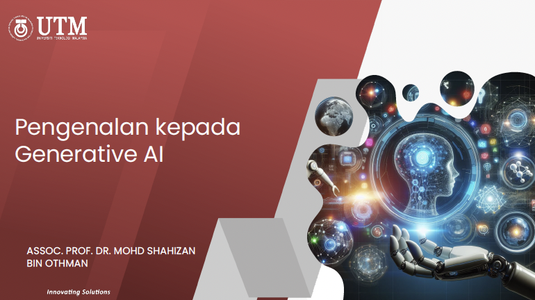

# Slot 1: Pengenalan kepada Generative AI

## Sinopsis
Slaid pembentangan ini membincangkan evolusi dan impak **Generative AI (GenAI)** dalam landskap digital moden, bermula daripada sejarah awal seperti Ujian Turing (1950) dan program ELIZA (1964) sehingga kemunculan teknologi canggih seperti **ChatGPT** pada tahun 2022. Ia memberikan kefahaman tentang landskap kecerdasan buatan yang merangkumi pembelajaran mesin dan pembelajaran mendalam, di samping menonjolkan kedudukan strategik Malaysia melalui **Pelan Hala Tuju AI (AI-RMAP)** serta ketersediaan negara dalam indeks AI global. Selain menganalisis transformasi sektor pekerjaan yang dipengaruhi oleh automasi, fokus utama diberikan kepada pemerkasaan pendidikan digital melalui platform **DELIMa** dengan memperkenalkan pelbagai alatan seperti **NotebookLM, Gemini, dan Microsoft Copilot**. Alatan ini digunakan secara praktikal untuk membantu penyelidikan, penulisan kreatif, serta penghasilan bahan bantu mengajar yang interaktif seperti **papan pemuka (dashboard)** analisis data dan infografik. Secara keseluruhannya, sumber ini berfungsi sebagai panduan komprehensif bagi memahami dan mengintegrasikan teknologi AI secara berkesan dalam pengurusan serta pembelajaran seharian.

 

### 🙌🏻 Connect with Me

    
    
    
    
     
 
 

