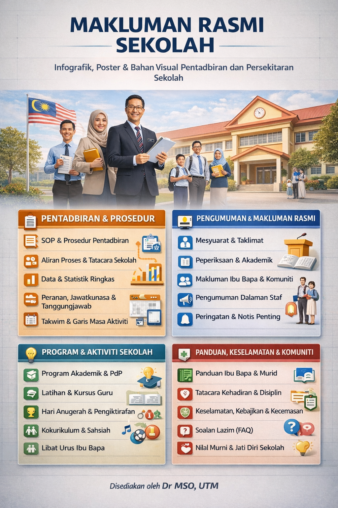

# 🎨 Prompt Template AI: Bahan Multimedia

 

## A. Infografik Pentadbiran Sekolah
1. [Infografik SOP & Prosedur Pentadbiran](prompt2a.md#a1%EF%B8%8F%E2%83%A3-template-prompt--infografik-sop--prosedur-pentadbiran)
2. [Infografik Aliran Proses & Tatacara Sekolah](prompt2a.md#a2%EF%B8%8F%E2%83%A3-template-prompt--infografik-aliran-proses--tatacara-sekolah)
3. [Infografik Data & Statistik Ringkas Sekolah](prompt2a.md#a3%EF%B8%8F%E2%83%A3-template-prompt--infografik-data--statistik-ringkas-sekolah)
4. [Infografik Peranan, Jawatankuasa & Tanggungjawab](prompt2a.md#a4%EF%B8%8F%E2%83%A3-template-prompt--infografik-peranan--jawatankuasa-sekolah)
5. [Infografik Takwim & Garis Masa Aktiviti Sekolah](prompt2a.md#a5%EF%B8%8F%E2%83%A3-template-prompt--infografik-takwim--garis-masa-sekolah)

## B. Poster & Banner Pengumuman Rasmi
1. [Poster/ Banner Makluman Mesyuarat & Taklimat](prompt2b.md#b1%EF%B8%8F%E2%83%A3-template-prompt--poster--banner-mesyuarat--taklimat)
2. [Poster/ Banner Makluman Peperiksaan & Akademik](prompt2b.md#b2%EF%B8%8F%E2%83%A3-template-prompt--poster--banner-makluman-peperiksaan)
3. [Poster/ Banner Makluman Ibu Bapa & Komuniti](prompt2b.md#b3%EF%B8%8F%E2%83%A3-template-prompt--poster--banner-makluman-ibu-bapa)
4. [Poster/ Banner Pengumuman Dalaman Staf](prompt2b.md#b4%EF%B8%8F%E2%83%A3-template-prompt--poster--banner-pengumuman-dalaman-staf)
5. [Poster/ Banner Peringatan & Notis Penting](prompt2b.md#b5%EF%B8%8F%E2%83%A3-template-prompt--poster--banner-peringatan--notis-penting)

## C. Poster & Banner Program Sekolah
1. [Poster/ Banner Program Akademik & PdP](prompt2c.md#c1%EF%B8%8F⃣-template-prompt--poster--banner-program-akademik--pdp)  
2. [Poster/ Banner Kursus & Latihan Guru](prompt2c.md#c2%EF%B8%8F⃣-template-prompt--poster--banner-kursus--latihan-guru)
3. [Poster/ Banner Hari Anugerah & Pengiktirafan](prompt2c.md#c3%EF%B8%8F⃣-template-prompt--poster--banner-hari-anugerah--pengiktirafan)
4. [Poster/ Banner Program Kokurikulum & Sahsiah](prompt2c.md#c4%EF%B8%8F⃣-template-prompt--poster--banner-program-kokurikulum--sahsiah)
5. [Poster/ Banner Program Libat Urus Ibu Bapa](prompt2c.md#c5%EF%B8%8F⃣-template-prompt--poster--banner-program-libat-urus-ibu-bapa)

## D. Bahan Visual Panduan & Makluman
1. [Infografik Panduan Ibu Bapa & Murid](prompt2d.md#d1%EF%B8%8F⃣-template-prompt--infografik-panduan-ibu-bapa--murid)
2. [Infografik Tatacara Kehadiran & Disiplin](prompt2d.md#d2%EF%B8%8F⃣-template-prompt--infografik-tatacara-kehadiran--disiplin)
3. [Infografik Keselamatan, Kebajikan & Kecemasan](prompt2d.md#d3%EF%B8%8F⃣-template-prompt--infografik-keselamatan-kebajikan--kecemasan)
4. [Poster/ Banner Panduan Penggunaan Sistem Sekolah](prompt2d.md#d4%EF%B8%8F⃣-template-prompt--poster--banner-panduan-penggunaan-sistem-sekolah)
5. [Infografik Soalan Lazim (FAQ) Sekolah](prompt2d.md#d5%EF%B8%8F⃣-template-prompt--infografik-soalan-lazim-faq-sekolah)

## E. Cover Buku, Laporan & Dokumen Rasmi
1. [Cover Buku Program/ Modul Sekolah](prompt2e.md#e1%EF%B8%8F⃣-template-prompt--cover-buku-program--modul-sekolah)
2. [Cover Laporan Tahunan/ Laporan Program](prompt2e.md#e2%EF%B8%8F⃣-template-prompt--cover-laporan-tahunan--laporan-program)
3. [Cover Kertas Kerja & Fail Pentadbiran](prompt2e.md#e3%EF%B8%8F⃣-template-prompt--cover-kertas-kerja--fail-pentadbiran)
4. [Rekaan Muka Hadapan Buku Teks Tambahan/ Modul PdP](prompt2e.md#e4%EF%B8%8F⃣-template-prompt--rekaan-muka-hadapan-buku-teks-tambahan--modul-pdp)
5. [Penyeragaman Identiti Visual Dokumen Rasmi Sekolah](prompt2e.md#e5%EF%B8%8F⃣-template-prompt--penyeragaman-identiti-visual-dokumen-rasmi-sekolah)

## F. Mencantikkan Kelas & Persekitaran Sekolah
1. [Visual Hiasan Kelas (Motivasi, Nilai Murni, Sahsiah)](prompt2f.md#f1%EF%B8%8F⃣-template-prompt--visual-hiasan-kelas)
2. [Poster Peraturan Kelas & Budaya Positif](prompt2f.md#f2%EF%B8%8F⃣-template-prompt--poster-peraturan-kelas--budaya-positif)
3. [Infografik Sudut Ilmu/ Sudut Bacaan](prompt2f.md#f3%EF%B8%8F⃣-template-prompt--infografik-sudut-ilmu--sudut-bacaan)
4. [Rekaan Visual Papan Kenyataan Kelas & Koridor](prompt2f.md#f4%EF%B8%8F⃣-template-prompt--rekaan-visual-papan-kenyataan-kelas--koridor)
5. [Tema Visual Kelas (Contoh: STEM, Literasi, Sahsiah)](prompt2f.md#f5%EF%B8%8F⃣-template-prompt--tema-visual-kelas)

## G. Visual Murid & Komuniti Sekolah
1. [Poster Motivasi Murid (Rendah/ Menengah)](prompt2g.md#g1%EF%B8%8F%E2%83%A3-template-prompt--poster-motivasi-murid)
2. [Visual Nilai Murni & Adab di Sekolah](prompt2g.md#g2%EF%B8%8F⃣-template-prompt--visual-nilai-murni--adab-di-sekolah)
3. [Poster Kesedaran (Anti-Buli, Disiplin, Keselamatan)](prompt2g.md#g3%EF%B8%8F⃣-template-prompt--poster-kesedaran)
4. [Bahan Visual Sambutan Hari Kebesaran & Perayaan](prompt2g.md%EF%B8%8F⃣-template-prompt--bahan-visual-sambutan-hari-kebesaran--perayaan)
5. [Poster Jati Diri Sekolah & Aspirasi Murid](prompt2g.md#g5%EF%B8%8F⃣-template-prompt--poster-jati-diri-sekolah--aspirasi-murid)

### 🙌🏻 Connect with Me

    
    
    
    
     
 
 

